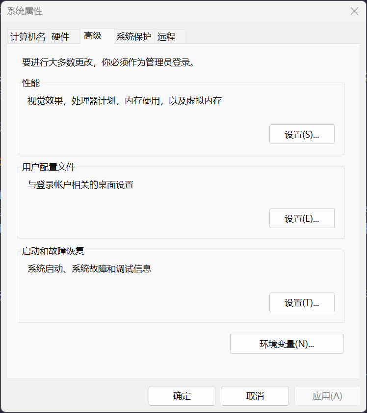

在上一篇文章中，我们对 Windows 系统的激活、桌面、组策略等功能进行了一些基本的认识。这些功能为我们使用 Windows 系统提供了便利，但 Windows 系统的高级功能远不止于此。在这一节中，我们会重新认识组策略，另外还有系统属性、本地安全策略和注册表功能等待我们去探索。这些功能将帮助我们更深入地了解和优化我们的 Windows 系统。

## 系统属性

系统属性是 Windows 系统中一个非常重要的功能，它可以帮助我们查看和配置系统的基本信息。通过系统属性，我们可以查看系统的版本、处理器信息、内存大小等重要信息。这些信息对于了解系统的性能和兼容性非常有帮助。

右键点击“此电脑”图标，选择“属性”。或者打开控制面板，选择“系统和安全” > “系统”。

在系统信息页面，你可以看到系统的版本号、处理器型号、内存大小等信息。

点击“高级系统设置”，可以打开系统属性页面，在这个页面，你可以进行一些高级的系统配置，比如环境变量的设置、虚拟内存的配置等。

首先，我们来了解一下性能选项：

在性能选项 - 视觉效果中，存在三个预设选项和一个自定义选项，安装系统默认会选择第一项配置，系统会根据你的电脑配置，以及用户的偏好来为你选择合适的视觉效果，一般来说默认会不勾选以下两个选项：

- 保存任务缩略图预览
- 在鼠标指针下选择阴影

勾选这两个选项的话，可能会加重 GPU 和 CPU 的负担，因为每次都要重新生成任务缩略图，并实时绘制阴影。并且，鼠标的阴影对用户来说并不友好，非常容易遮挡视线，所以微软的默认选项还是考虑了一些用户需求的。

我在工作专用系统上，使用的是自定义的方案，关闭了除“平滑字体”外的所有选项，极大程度上避免了图形界面上的性能损失，因为工作的时候并不希望被摇晃的动画打扰。如果你也有“希望电脑更快一点”的需求的话，也可以针对此处的视觉效果进行定制。**但我希望你和我一样，不要关闭平滑字体**，因为这会导致字体的锯齿感更加明显，非常影响使用体验。

性能选项 - 高级中存在两个选项——处理器计划和虚拟内存。

处理器计划比较容易理解，就是系统优先把资源分配给后台服务（前文有提到服务），还是用户的应用程序。家用电脑选择应用程序、服务器选择后台服务即可。

虚拟内存是 Windows 系统用来扩展物理内存的一种机制。当物理内存（RAM）不足时，系统会将一部分硬盘空间用作虚拟内存，以确保系统和应用程序能够正常运行。如果没有虚拟内存，当物理内存用完时，系统可能会出现卡顿、崩溃甚至无法运行某些程序的情况。

关于虚拟内存，让我想到一个知乎上的问题——如果物理内存足够，虚拟内存能不能关闭？

答案是能关，但不建议这么做。

假设物理内存足够，但如果我在程序内写死申请虚拟内存，而你没有，怎么办？

有一部分软件真是把调用虚拟内存写在程序内部的。

因此，虚拟内存可以调大，也可以缩小，但不要关闭，在物理内存足够的条件下，就当它不存在即可。并且 Windows 系统通常会自动管理虚拟内存的大小和位置。系统会根据当前的内存使用情况和系统负载动态调整虚拟内存的大小，以确保系统运行的高效性和稳定性，并没有手动关闭虚拟内存的必要。

接下来说一说环境变量，环境变量是操作系统中的一种数据，用于存储系统和应用程序的配置信息。这些变量在系统启动时加载，并在运行过程中被应用程序和系统服务使用。环境变量可以帮助应用程序找到必要的文件、设置默认路径、配置用户偏好等。

接下来我们详细了解一下环境变量，包括系统环境变量和用户环境变量。系统环境变量是全局的，对所有用户和应用程序都有效。这些变量通常由系统管理员或安装程序设置，用于配置系统级别的路径和参数。

### 系统环境变量

#### 常见的系统环境变量

- **`Path`**：这是最常用的环境变量之一，用于定义系统在哪些目录中查找可执行文件。当你在命令行中输入一个命令时，系统会依次在 `Path` 中指定的目录中查找对应的可执行文件。
- **`TEMP` 和 `TMP`**：这些变量指定了系统临时文件的存储位置。应用程序通常会将临时文件存储在这些目录中。
- **`WINDIR`**：指向 Windows 系统目录，通常是 `C:\Windows`。
- **`SYSTEMROOT`**：指向 Windows 系统根目录，通常是 `C:\Windows`。
- **`COMPUTERNAME`**：当前计算机的名称。
- **`USERNAME`**：当前登录用户的用户名。

### 用户环境变量

用户环境变量是针对特定用户的，只对当前用户有效。这些变量通常由用户自己设置，用于配置个人偏好和应用程序的特定设置。

#### 常见的用户环境变量

- **`Path`**：用户可以在这个变量中添加自己的路径，这些路径会添加到系统 `Path` 变量中。这样，用户可以在命令行中直接运行自己添加的路径中的可执行文件。
- **`TEMP` 和 `TMP`**：用户可以指定自己的临时文件存储位置，这通常用于覆盖系统默认的临时文件路径。
- **`USERPROFILE`**：指向当前用户的个人文件夹，通常是 `C:\Users\<用户名>`。
- **`APPDATA`**：指向当前用户的应用程序数据文件夹，通常是 `C:\Users\<用户名>\AppData\Roaming`。
- **`LOCALAPPDATA`**：指向当前用户的本地应用程序数据文件夹，通常是 `C:\Users\<用户名>\AppData\Local`。

通过将常用的目录路径添加到 `Path` 变量中，你可以在命令行中直接运行这些目录中的可执行文件，而无需输入完整的路径。许多应用程序会使用环境变量来查找配置文件、数据文件等。通过设置环境变量，你可以指定这些文件的位置，从而实现应用程序的个性化配置。某些应用程序依赖特定的环境变量来正常运行。通过正确设置这些变量，可以确保这些应用程序的兼容性和稳定性。

环境变量对系统的运行非常重要，错误的修改可能会导致系统或应用程序无法正常工作。在修改环境变量之前，建议先备份当前的设置。在修改 `Path` 变量时，确保添加的路径不会与现有的路径冲突。如果有多个路径指向同一个可执行文件，系统会使用第一个找到的文件。

## 组策略

组策略是 Windows 系统中一个非常强大的功能，它可以帮助我们对系统进行更细致的配置和管理。通过组策略，我们可以控制用户权限、设置系统行为、优化系统性能等。

按下 `Win + R` 键，打开“运行”对话框，输入 `gpedit.msc`，然后按回车键，就可以打开“本地组策略编辑器”，这是组策略的全称。

在网络上，有些网友可能把“组策略”看错为“策略组”，知道这是一个东西即可。

组策略的主要功能有以下三点：

- **用户配置**：设置用户权限、控制用户可以访问的资源等。
- **计算机配置**：设置计算机的系统行为、优化系统性能等。
- **策略设置**：通过组策略创建和管理各种策略，比如自动更新策略、安全策略等。

组策略的功能相比系统设置更加全面，可以修改一些系统设计师不想让你改动的配置，但是，在改动之前，你务必要对自己在做什么有一个清晰正确的认知，三思而后行。

## 本地安全策略

本地安全策略是 Windows 系统中一个非常重要的安全功能，它可以帮助我们配置和管理系统的安全策略。通过本地安全策略，我们可以设置用户权限、控制访问权限、配置安全策略等。

按下 `Win + R` 键，打开“运行”对话框，输入 `secpol.msc`，然后按回车键，或者打开控制面板，选择“管理工具” > “本地安全策略”，就能打开本地安全策略。

### 本地安全策略的主要功能

- **账户策略**：设置密码策略、账户锁定策略等。
- **本地策略**：设置用户权限分配、审核策略等。
- **安全选项**：配置各种安全选项，比如用户账户控制、网络访问等。

## 注册表

注册表是 Windows 系统中一个非常重要的系统数据库，它存储了系统的所有配置信息。通过注册表，我们可以对系统进行更深入的配置和优化。

按下 `Win + R` 键，打开“运行”对话框，输入 `regedit`，然后按回车键，或者打开控制面板，选择“管理工具” > “注册表编辑器”，就可以打开注册表编辑器。

### 注册表的主要功能

- **查看系统配置**：查看系统的各种配置信息，比如软件安装信息、系统设置等。
- **修改系统设置**：修改系统的各种设置，比如隐藏文件扩展名、禁用任务管理器等。
- **优化系统性能**：进行一些系统优化操作，比如禁用不必要的服务、优化启动项等。

但需要注意，注册表是一个非常重要的系统数据库，错误的修改可能会导致系统崩溃。因此，在修改注册表时一定要谨慎操作，针对某项一项配置，修改它的优先级为：系统设置->组策略->注册表。只有在一项配置实在无处可改，但又非常需要时（例如将 Windows11 右键菜单还原为 Windows10 菜单），才考虑直接对注册表进行修改。

注册表中充斥着大量以 UUID 或随即符号字符串命名的项，这些项的可读性是非常差的，你很难知道你随手的一个改动可能造成什么样的连锁反应，因此修改注册表一定要非常慎重。

通过以上这些高级功能，我们可以更深入地了解和优化我们的 Windows 系统。希望这篇文章能够帮助你更好地使用 Windows 系统，提高你的工作效率和系统性能。