在当今的软件开发和系统管理领域，虚拟化技术扮演着至关重要的角色。它不仅可以帮助我们高效地利用硬件资源，还能提供隔离的环境，方便开发、测试和部署应用程序。本文将通俗地介绍几种常见的虚拟化技术：I 型和 II 型虚拟机、Hyper-V 与 Hyper-V 网络、Windows Subsystem for Linux (WSL)、Docker 与 Podman，以及 Windows 沙盒。

## I 型和 II 型虚拟机

虚拟机（VM）是一种虚拟化的计算机环境，它模拟了物理计算机的功能。通过虚拟机，你可以在一台物理机上运行多个操作系统，每个操作系统都像是运行在独立的物理机上一样。

1. I 型虚拟机

I 型虚拟机（也称为裸金属虚拟机）直接运行在物理硬件上，没有宿主机操作系统。这种虚拟机管理程序（Hypervisor）直接管理硬件资源，为虚拟机提供高效的资源分配。常见的 I 型虚拟机管理程序有 VMware ESXi、PVE 和 Microsoft Hyper-V。

2. II 型虚拟机

II 型虚拟机（也称为宿主虚拟机）运行在宿主机操作系统之上。这种虚拟机管理程序依赖于宿主机操作系统的内核来管理硬件资源。常见的 II 型虚拟机管理程序有 VMware Workstation 和 Oracle VirtualBox。

那么如何针对性地选择所需的虚拟机呢？首先可以笼统地这么认为：
**I 型虚拟机**：适合需要高性能和高资源利用率的场景，如数据中心和云计算环境。
**II 型虚拟机**：适合个人用户和开发人员，因为它更易于安装和使用，且对硬件要求较低。

但实际使用我们还是得根据自己的需求来进行合理选择。

### 常用虚拟机介绍

## 常用虚拟机介绍

虚拟机（VM）是一种强大的技术，允许你在一台物理机上运行多个操作系统，每个操作系统都像是运行在独立的物理机上一样。不同的虚拟机软件有不同的特点和适用场景。以下是一些常用的虚拟机软件的介绍：

### 1. Hyper-V

Hyper-V 是 Microsoft 提供的 I 型虚拟机管理程序，用于创建和运行虚拟机。它支持多种操作系统，包括 Windows 和 Linux。它直接运行在物理硬件上，提供高效的资源分配。

hyper-V 与 Windows 系统深度集成，支持 Windows Server 和 Windows 10/11。提供高级的安全功能，如虚拟机隔离和加密。Hyper-V 管理器和 PowerShell 提供强大的管理功能。

一旦你启用 Hyper-V，那么你的主机系统也会被虚拟化，这会造成约 5% 的 CPU 性能降低，但使用过程中基本不会有感知。

在现代的 Windows 11 系统中，许多功能都与 Hyper-V 进行了深度绑定，例如内核虚拟化安全功能、容器功能、WSL 功能等嗾使依赖于 Hyper-V 的，因此不再建议在 Windows11 系统中禁用 Hyper-V 了，Win10 系统的话可以禁用。

### 2. VMware Workstation

VMware Workstation 是 VMware 提供的 II 型虚拟机管理程序，运行在宿主机操作系统之上。它支持多种操作系统，包括 Windows 和 Linux。

它的用户界面非常友好，无需学习即可轻松上手。并且支持 Windows 和 Linux 作为宿主机操作系统，虚拟机可直接跨平台迁移，非常方便。他还可以很方便地进行 USB 与硬盘直通。

但该虚拟机相对臃肿，资源占用较高，并且性能稍差。

### 3. VMware ESXi 和 Proxmox VE

VMware ESXi 是 VMware 提供的 I 型虚拟机管理程序，用于数据中心和云计算环境。它直接运行在物理硬件上，提供高效的资源管理和虚拟化功能。直接运行在物理硬件上，提供高效的资源分配。

Proxmox VE 是一个开源的 I 型虚拟机管理程序，基于 Debian Linux。它支持虚拟机和容器的管理，提供高效的资源管理和虚拟化功能。

两款软件（也许说是发行版更加合适）功能类似，但 ESXi 在硬件兼容性方面不如 PVE。

### 4. Parallels Desktop

Parallels Desktop 是 Parallels 提供的 II 型虚拟机管理程序，专门用于 macOS 系统。它允许你在 Mac 上运行 Windows 和其他操作系统。用户界面友好，适合个人用户和开发人员。

### 5. Oracle VM VirtualBox

Oracle VM VirtualBox 是 Oracle 提供的 II 型虚拟机管理程序，运行在宿主机操作系统之上。它支持多种操作系统，包括 Windows、Linux 和 macOS。

这款虚拟机程序相比 VM workstation 更加轻量化，该有的功能也都有，适合虚拟化要求不高的个人使用。

## Hyper-V 与 Hyper-V 网络

Hyper-V 是微软提供的虚拟化技术，它允许你在一台物理机上运行多个虚拟机。每个虚拟机就像是一个独立的计算机，有自己的操作系统和资源。Hyper-V 不仅提供了创建和管理虚拟机的功能，还提供了强大的网络配置选项，让你可以灵活地设置虚拟机的网络连接。

### Hyper-V 新建虚拟机

创建一个新的虚拟机其实并不复杂，就像是在你的电脑上安装一个新的软件一样。首先，你需要打开 Hyper-V 管理器，这是一个专门用来管理虚拟机的工具。在管理器里，你会看到一个“新建”按钮，点击它，就会弹出一个向导，引导你一步步完成虚拟机的创建。

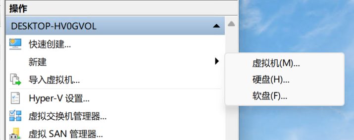

在这个过程中，你需要给虚拟机起一个名字，这个名字就像是虚拟机的“身份证”，方便你以后识别它。然后，你需要选择虚拟机的内存大小。内存就像是虚拟机的“大脑”，决定了它能同时处理多少任务。如果你打算在虚拟机里运行一些比较复杂的程序，就需要分配更多的内存。

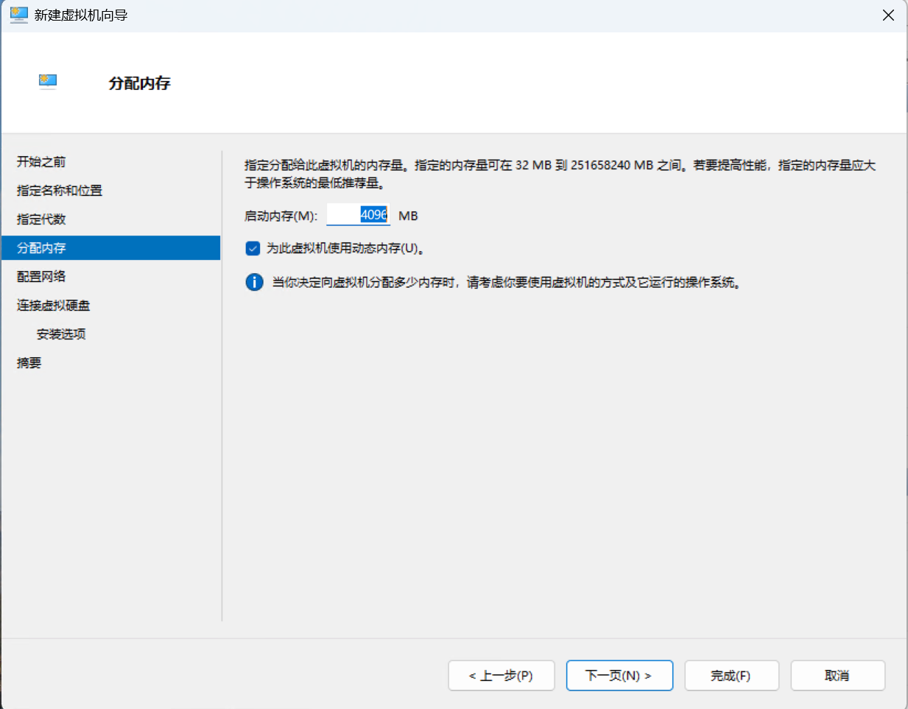
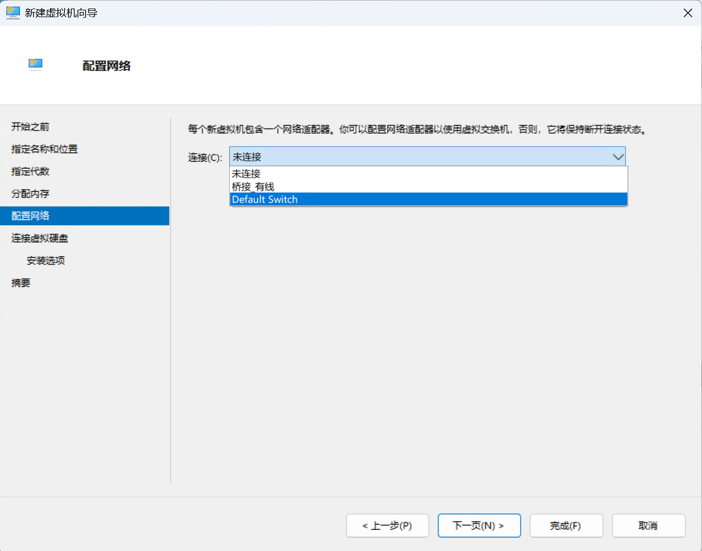
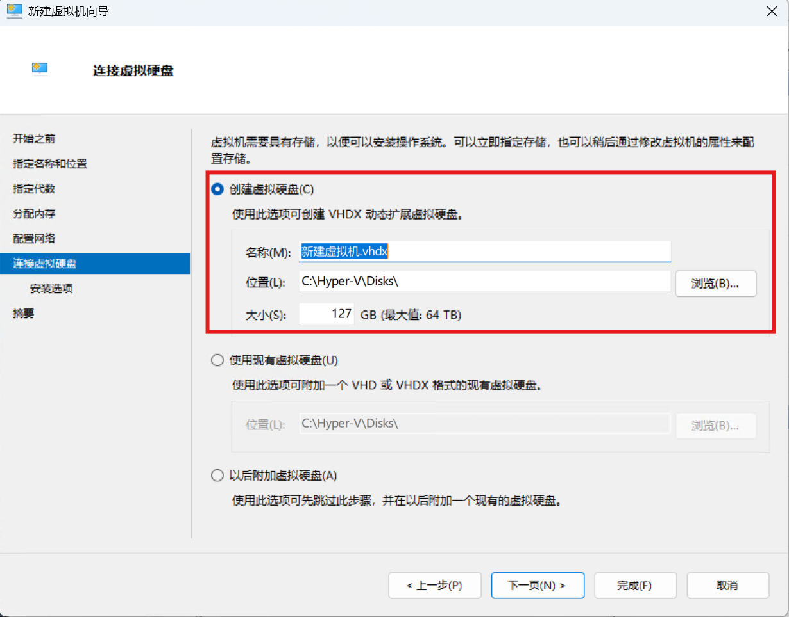

接下来，你需要选择虚拟机的操作系统。这通常是一个 ISO 文件，就像是操作系统的“种子”，Hyper-V 会用它来安装操作系统。最后，你需要配置虚拟机的网络连接。这一步很重要，因为它决定了虚拟机如何与外界通信。

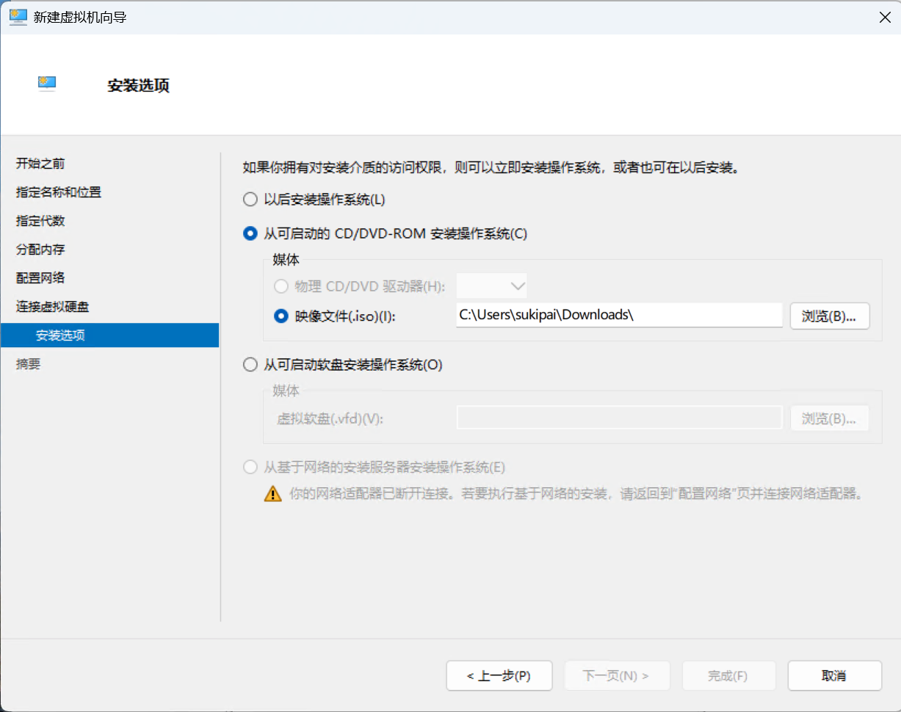

### 配置项详解

Hyper-V 本身是可配置的，一般来说系统默认配置已经可以满足大部分使用需求，但我们也可以对某些项进行优化，例如默认虚拟机位置、硬盘位置等（默认路径比较深，很难找）。

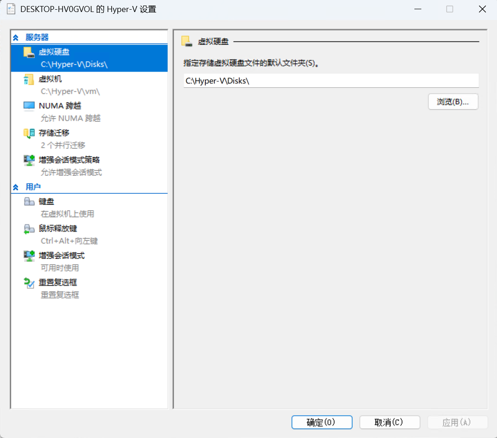

在创建虚拟机的过程中也存在很多配置项，这些配置项就像是虚拟机的“参数”，决定了虚拟机的性能和功能。

- **安全启动**：如果还没有安装好系统，应取消勾选，否则无法进行 ISO 启动。如果需要安装 Win11，则应该勾选“启用受信任的平台模块”。
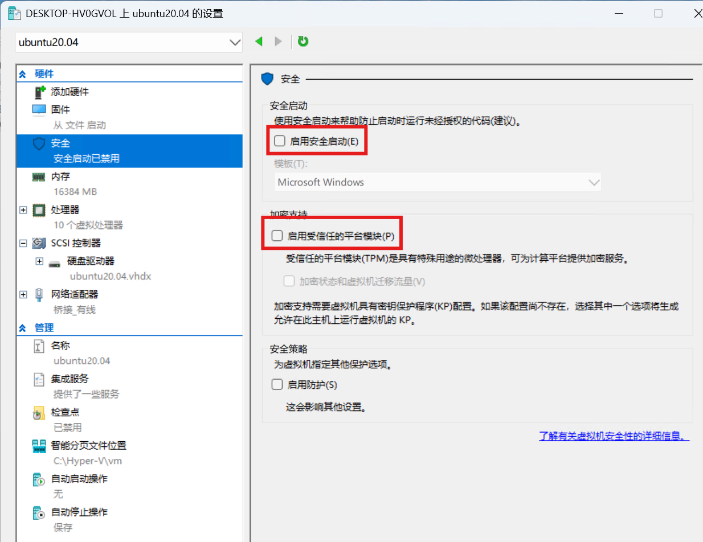
- **内存大小**：这个参数决定了虚拟机可以使用的内存量。如果你的物理机内存足够大，可以给虚拟机分配更多的内存，这样虚拟机运行起来就会更流畅。
- **处理器数量**：这个参数决定了虚拟机可以使用的处理器核心数量。如果你的物理机有多个核心，可以给虚拟机分配多个核心，这样虚拟机的处理能力就会更强。（默认全核心）
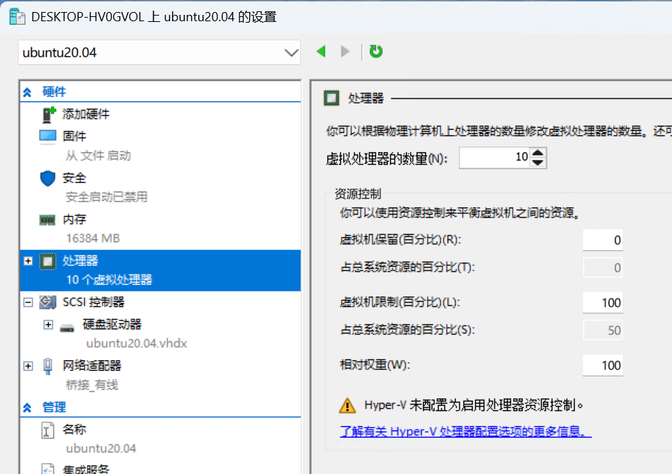
- **硬盘大小**：这个参数决定了虚拟机可以使用的磁盘空间。你可以选择创建一个新的虚拟硬盘，也可以使用已有的硬盘文件。
- **网络连接**：这个参数决定了虚拟机如何与外界通信。你可以选择内部网络、外部网络或专用网络，每种网络类型都有不同的用途。
- **检查点**：快照功能，如果启用则硬盘会根据检查点数量被分为多块，这时该 vhdx 文件将无法进行物理启动（详情可见前面文章）。
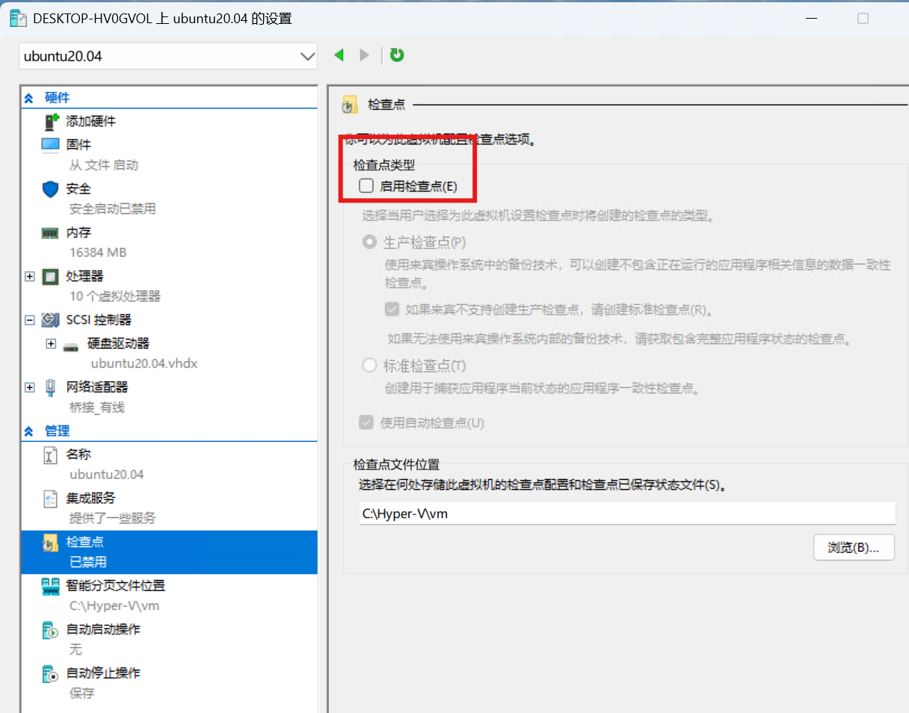
- **自动启停**：制定虚拟机启停规则。
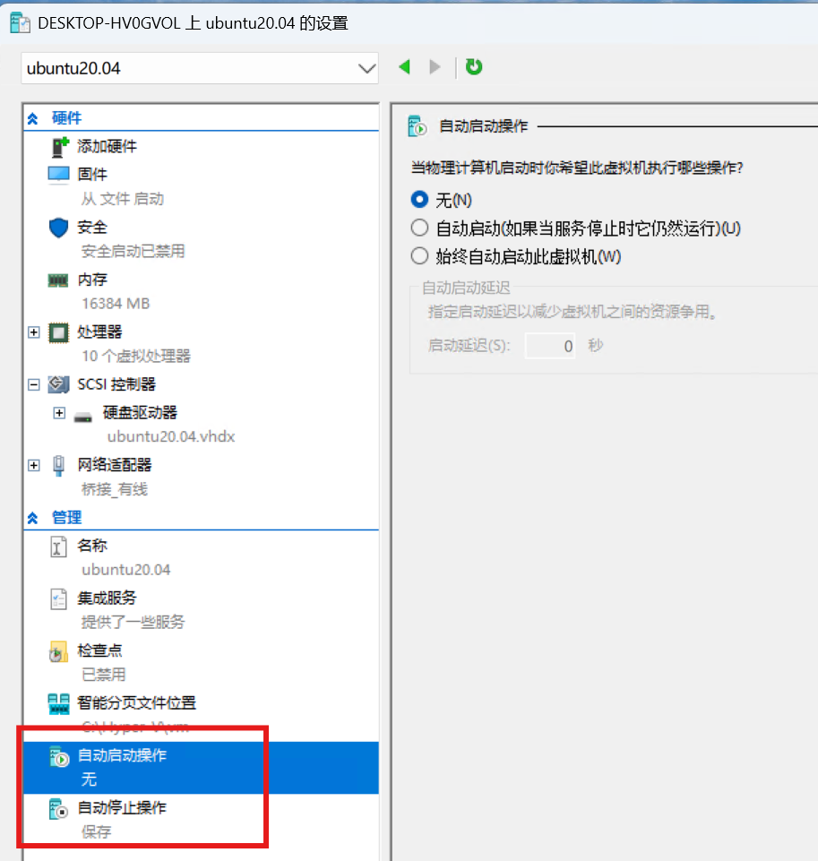

### NAT 网络与桥接网络

网络配置是 Hyper-V 中非常重要的一部分，它决定了虚拟机如何与外界通信。Hyper-V 提供了多种网络配置选项，其中最常用的是 NAT 网络和桥接网络。

#### NAT 网络

NAT 网络就像是一个“中转站”，它允许虚拟机通过宿主机的网络连接访问外部网络。在 NAT 网络中，虚拟机的 IP 地址是由 Hyper-V 自动分配的，虚拟机之间可以互相通信，但外部网络无法直接访问虚拟机。

这种网络配置非常适合那些需要访问互联网但不需要被外部网络访问的虚拟机。例如，你可以在虚拟机里运行一个开发环境，通过 NAT 网络访问外部的代码仓库，但外部网络无法直接访问你的开发环境。

Windows 非 Server 版都自带了一个 Default Switch 网卡，该网卡即 NAT 网卡。Server 版本默认不带任何虚拟网卡，需要自己创建。

#### 桥接网络

桥接网络就像是一个“桥梁”，它将虚拟机的网络连接直接连接到物理网络上。在桥接网络中，虚拟机就像是物理网络中的一个独立设备，有自己的 IP 地址，可以被外部网络直接访问。

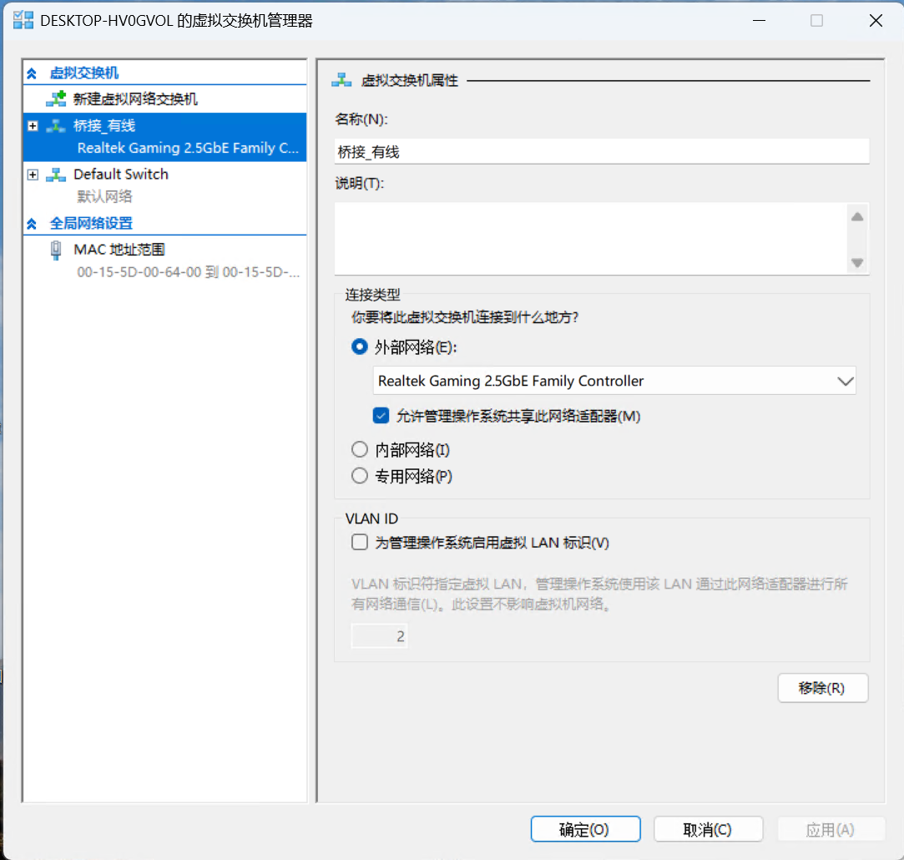

这种网络配置非常适合那些需要被外部网络访问的虚拟机。例如，你可以在虚拟机里运行一个 Web 服务器，通过桥接网络，外部网络可以直接访问这个 Web 服务器。

Hyper-V 的桥接需要自己指定所桥接的网卡，无法做到智能切换——使用哪个网络就桥接到哪个网络。VM Workstation 中的桥接网络则可以智能选择所桥接的网卡。

### 总结

Hyper-V 是一个非常强大的虚拟化工具，它不仅提供了创建和管理虚拟机的功能，还提供了灵活的网络配置选项。通过合理配置虚拟机的网络连接，你可以满足不同的需求，无论是开发、测试还是部署应用程序。希望这篇文章能帮助你更好地理解和使用 Hyper-V。


## Windows Subsystem for Linux

## Windows Subsystem for Linux (WSL)

Windows Subsystem for Linux (WSL) 是微软在 Windows 10 和 Windows 11 中引入的一项功能，它允许用户在 Windows 系统上直接运行 Linux 二进制可执行文件（ELF 格式）。WSL 提供了一个兼容的 Linux 环境，无需安装完整的 Linux 虚拟机，即可在 Windows 上运行 Linux 命令行工具和应用程序。

WSL 1 是 WSL 的第一个版本，它通过将 Linux 系统调用转换为 Windows 系统调用来实现 Linux 环境的运行。WSL 1 使用的是一个转换层，而不是真正的 Linux 内核。WSL 1 的启动速度非常快，几乎可以瞬间启动。在访问 Windows 文件系统时，WSL 1 的磁盘性能表现良好。但由于 WSL 1 使用的是转换层，某些复杂的 Linux 系统调用可能无法完全兼容，导致一些 Linux 应用程序无法正常运行。此外，WSL 1 不支持某些 Linux 内核功能，如 Docker 等容器技术。


WSL 2 是 WSL 的第二个版本，它引入了一个真正的 Linux 内核，运行在轻量级的虚拟机中。WSL 2 提供了更好的系统调用兼容性和内核功能支持。WSL 2 使用真正的 Linux 内核，支持更多的 Linux 系统调用，使得大多数 Linux 应用程序都能正常运行。WSL 2 支持 Docker 等容器技术，适合开发和测试容器化应用程序。在某些场景下，WSL 2 的性能比 WSL 1 更好，尤其是在处理复杂的文件操作和网络请求时。但在在访问 Windows 文件系统时，由于访问方式为**虚拟网络**，因此，WSL 2 的磁盘 IO 性能远不如 WSL 1，这个缺陷也使得许多用户转向使用完全的虚拟机。其次，由于 WSL 2 运行在虚拟机中，启动速度也会比 WSL 1 稍慢。

### WSL 2 与传统虚拟机 Linux 的对比

WSL 2 与 Windows 系统深度集成，可以在 Windows 和 Linux 环境之间无缝切换。WSL 2 的资源占用相对较低，不需要像虚拟机那样分配大量的内存和处理器资源。虽然 WSL 2 的启动速度比 WSL 1 稍慢，但仍然比虚拟机快很多。WSL 2 可以直接访问 Windows 文件系统，文件共享非常方便，虚拟机与 Windows 系统之间的文件共享需要额外的配置，不如 WSL 2 方便。

WSL 2 使用的是微软提供的 Linux 内核，但该内核更新并不及时，如果用户需要新版本内核，则需要自行编译。虽然 WSL 2 支持大多数 Linux 功能，但在某些特殊场景下，可能仍然会遇到兼容性问题。WSL 2 虽然可以直接访问 Windows 文件系统，但这也许会带来一些安全问题。

虚拟机 Linux 是一个完全独立的系统，有自己的内核和资源，可以运行任何 Linux 发行版，也可以支持所有 Linux 功能，包括内核更新和定制。

### 总结

以前在知乎上看到一个问题，问 WSL 能最终取代 Linux 吗？

我认为如果 WSL1 一直开发下去，并完美实现所有 Linux 的系统调用，那我认为这能算是真正的“取代”了 Linux。但现实是，这个坑实在太大，大到微软都扛不住，放弃了 WSL1 技术路线，而转向了虚拟机路线。虚拟机路线确实减少了许多麻烦，但 WSL2 使用了完整的 Linux 内核，实际上更倾向于被当作某个 Linux 发行版，这就说明 Linux 永远也无法被 WSL2 取代了。

WSL 2 是一个非常强大的工具，它结合了 Windows 和 Linux 的优点，提供了高效的开发环境。如果你需要在 Windows 上运行 Linux 命令行工具和应用程序，WSL 2 是一个非常好的选择。与虚拟机 Linux 相比，WSL 2 的资源占用更低，启动速度更快，文件共享也更方便。然而，如果你需要运行资源密集型应用程序或需要完全独立的 Linux

## Docker 与 Podman

## Docker 与 Podman

Docker 和 Podman 都是流行的容器化工具，它们允许开发者将应用程序及其依赖打包成一个独立的容器，从而实现应用程序的快速部署和一致性运行。尽管它们在功能上有很多相似之处，但在设计和使用上也有一些关键的区别。

Docker 是一个开源的容器化平台，它允许开发者将应用程序及其依赖打包成一个独立的容器。这些容器可以在任何支持 Docker 的环境中运行，从而实现“一次构建，到处运行”的目标。

尽管现在容器技术不断涌现，许多新的技术都将 Docker 的一些槽点进行了解决，但 Docker 仍然是容器技术的“开山鼻祖”，Docker 做出的贡献应被永远铭记。

Podman 是一个开源的容器化工具，旨在提供与 Docker 类似的功能，但设计上更加轻量级和安全。Podman 的主要作用包括：

- **无守护进程**：Podman 不需要运行一个后台守护进程，减少了系统资源的占用和潜在的安全风险。
- **多用户支持**：Podman 支持多用户操作，每个用户可以独立管理自己的容器，而不会相互干扰。
- **与 Docker 兼容**：Podman 支持 Dockerfile 和 Docker CLI 命令，使得从 Docker 迁移到 Podman 非常容易。
- **安全性**：Podman 提供了更好的安全性，支持根用户和非根用户操作，减少了权限提升的风险。
- **网络代理支持**：Docker 对网络代理的处理不佳，很多时候都走不了本地代理，但 Podman 配置代理就像一般的应用程序一样，非常容易。

从我个人使用体验来看，如果是 root 常驻的系统（如 Openwrt、各类 NAS 系统等），Docker 与 Podman 区别不大，但对于常见的 Linux 发行版（Arch、Debian、Fedora 等），Podman 易用性更好。

以下是 podman 命令的 help 页面，可以看到，功能非常丰富完善。

```txt
❯ podman -h
Manage pods, containers and images

Usage:
  podman [options] [command]

Available Commands:
  artifact    Manage OCI artifacts
  attach      Attach to a running container
  auto-update Auto update containers according to their auto-update policy
  build       Build an image using instructions from Containerfiles
  commit      Create new image based on the changed container
  compose     Run compose workloads via an external provider such as docker-compose or podman-compose
  container   Manage containers
  cp          Copy files/folders between a container and the local filesystem
  create      Create but do not start a container
  diff        Display the changes to the object's file system
  events      Show podman system events
  exec        Run a process in a running container
  export      Export container's filesystem contents as a tar archive
  farm        Farm out builds to remote machines
  generate    Generate structured data based on containers, pods or volumes
  healthcheck Manage health checks on containers
  help        Help about any command
  history     Show history of a specified image
  image       Manage images
  images      List images in local storage
  import      Import a tarball to create a filesystem image
  info        Display podman system information
  init        Initialize one or more containers
  inspect     Display the configuration of object denoted by ID
  kill        Kill one or more running containers with a specific signal
  kube        Play containers, pods or volumes from a structured file
  load        Load image(s) from a tar archive
  login       Log in to a container registry
  logout      Log out of a container registry
  logs        Fetch the logs of one or more containers
  machine     Manage a virtual machine
  manifest    Manipulate manifest lists and image indexes
  mount       Mount a working container's root filesystem
  network     Manage networks
  pause       Pause all the processes in one or more containers
  pod         Manage pods
  port        List port mappings or a specific mapping for the container
  ps          List containers
  pull        Pull an image from a registry
  push        Push an image to a specified destination
  rename      Rename an existing container
  restart     Restart one or more containers
  rm          Remove one or more containers
  rmi         Remove one or more images from local storage
  run         Run a command in a new container
  save        Save image(s) to an archive
  search      Search registry for image
  secret      Manage secrets
  start       Start one or more containers
  stats       Display a live stream of container resource usage statistics
  stop        Stop one or more containers
  system      Manage podman
  tag         Add an additional name to a local image
  top         Display the running processes of a container
  unmount     Unmount working container's root filesystem
  unpause     Unpause the processes in one or more containers
  unshare     Run a command in a modified user namespace
  untag       Remove a name from a local image
  update      Update an existing container
  version     Display the Podman version information
  volume      Manage volumes
  wait        Block on one or more containers
```

听说部分发行版已经使用 podman 取代了 docker，不知道是不是真的^_^。

## Windows 沙盒

### Windows 沙盒

**Windows 沙盒**（Windows Sandbox）是 Windows 10 和 Windows 11 中的一个轻量级虚拟化功能，旨在提供一个安全的、隔离的环境，用于运行不受信任的应用程序或进行安全测试。它类似于一个临时的虚拟机，但启动速度更快，资源占用更少。特别适合需要在安全环境中运行不受信任的软件或进行安全测试的用户。它提供了高度的隔离性和安全性，同时启动速度快，资源占用低。通过简单的启用和使用步骤，用户可以轻松地在沙盒中运行和测试各种应用程序，而无需担心对主系统造成损害。

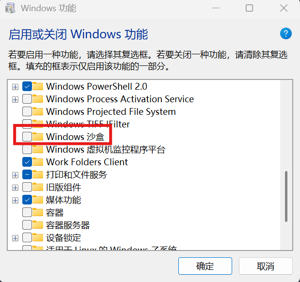

安装成功后，打开沙盒，可以开启一个纯净且隔离的 Windows 系统，该系统可以随意折腾。沙盒关闭后，数据将会被全部清除。

## Hyper-V 最成功的应用场景——XBOX

### Hyper-V 在 Xbox 中的应用

Hyper-V 是微软的虚拟化技术，广泛应用于 Windows 操作系统中。在 Xbox 游戏机中，Hyper-V 被用于提供安全性和快速启动功能，确保游戏机的稳定性和用户体验。以下是 Xbox 如何通过 Hyper-V 实现这些功能的详细讲解，该部分内容通过 AI 完成撰写。

### 1. 安全性保障

#### 1.1 隔离性
- **虚拟机隔离**：Xbox 使用 Hyper-V 创建多个虚拟机（VM），每个虚拟机运行不同的操作系统和应用程序。例如，一个虚拟机运行 Xbox 操作系统，另一个虚拟机运行游戏。这种隔离确保了游戏和系统之间的相互独立，防止恶意软件或不稳定的代码影响整个系统。
- **安全启动**：Xbox 利用 Hyper-V 的安全启动功能，确保只有经过验证的固件和操作系统可以启动。这防止了恶意软件在启动过程中注入，增强了系统的安全性。

#### 1.2 安全容器
- **容器化**：Xbox 使用 Hyper-V 的容器技术，将游戏和应用程序封装在独立的容器中。每个容器都有自己的资源和命名空间，确保它们之间不会相互干扰。
- **权限管理**：通过 Hyper-V 的权限管理功能，Xbox 可以限制每个容器的权限，防止恶意软件获取系统级权限。这进一步增强了系统的安全性。

#### 1.3 安全更新
- **隔离更新**：Xbox 利用 Hyper-V 的隔离特性，确保系统更新和游戏更新在独立的环境中进行。这防止了更新过程中可能出现的冲突和安全问题。
- **回滚机制**：如果更新出现问题，Xbox 可以利用 Hyper-V 的快照功能，快速回滚到之前的稳定状态，确保系统的稳定性和安全性。

### 2. 快速启动功能

#### 2.1 快速启动机制
- **休眠状态**：Xbox 利用 Hyper-V 的休眠功能，将系统和游戏的状态保存到磁盘上。当用户重新启动 Xbox 时，系统可以直接从休眠状态恢复，而不是从头开始启动，大大缩短了启动时间。
- **快速恢复**：Hyper-V 的快速恢复功能允许 Xbox 在短时间内恢复到之前的状态，包括系统设置、游戏进度等。这使得用户可以快速回到游戏中，提升用户体验。

#### 2.2 资源管理
- **动态资源分配**：Xbox 利用 Hyper-V 的动态资源分配功能，根据当前的使用情况，自动调整系统和游戏的资源分配。这确保了系统在启动和运行过程中始终保持高性能。
- **优先级管理**：Hyper-V 允许 Xbox 设置不同的优先级，确保关键任务（如系统启动和游戏加载）优先获得资源。这进一步提升了启动速度和运行性能。

#### 2.3 硬件加速
- **GPU 虚拟化**：Xbox 利用 Hyper-V 的 GPU 虚拟化功能，将 GPU 资源分配给不同的虚拟机。这不仅提高了游戏的图形性能，还确保了系统在启动和运行过程中能够快速响应。
- **存储优化**：Xbox 利用 Hyper-V 的存储优化功能，确保系统和游戏的读写操作高效进行。这进一步缩短了启动时间和加载时间。

### 3. 具体实现

#### 3.1 系统架构
- **主虚拟机**：运行 Xbox 操作系统，负责管理用户界面、系统设置和安全功能。
- **游戏虚拟机**：运行游戏，每个游戏运行在独立的虚拟机中，确保游戏之间的隔离和独立性。
- **安全虚拟机**：负责安全功能，如安全启动、权限管理和安全更新。

#### 3.2 安全启动流程
1. **硬件验证**：Xbox 在启动时，首先验证硬件的完整性，确保没有被篡改。
2. **固件验证**：通过 Hyper-V 的安全启动功能，验证固件的合法性。
3. **操作系统验证**：验证 Xbox 操作系统的完整性，确保没有被恶意软件篡改。
4. **游戏验证**：在游戏启动时，验证游戏的完整性和合法性，确保没有被篡改。

#### 3.3 快速启动流程
1. **休眠状态保存**：在用户关闭 Xbox 时，系统将当前状态保存到磁盘上。
2. **快速恢复**：在用户重新启动 Xbox 时，系统从休眠状态恢复，而不是从头开始启动。
3. **资源优化**：在恢复过程中，Hyper-V 动态分配资源，确保系统快速启动。