在数字化时代，无论是个人用户还是企业，都依赖于计算机系统来存储和处理大量重要数据。然而，数据丢失的风险始终存在，可能是由于硬件故障、软件错误、人为失误或恶意攻击等原因。为了有效应对这些风险，自动化备份成为保护数据安全的关键手段。而 Windows 系统中的任务计划程序和 Windows 备份功能，为我们提供了强大的工具来实现数据备份的自动化，开启一段高效、可靠的自动化之旅。

## 任务计划程序详解

任务计划程序是 Windows 系统中一个功能强大的工具，它允许用户创建和管理自动化任务。通过任务计划程序，我们可以设置各种任务在特定的时间或条件下自动运行，例如定期备份数据、自动更新软件、清理临时文件等。

### 创建任务

1. 打开任务计划程序：可以通过在开始菜单中搜索“任务计划程序”或在控制面板中找到它。
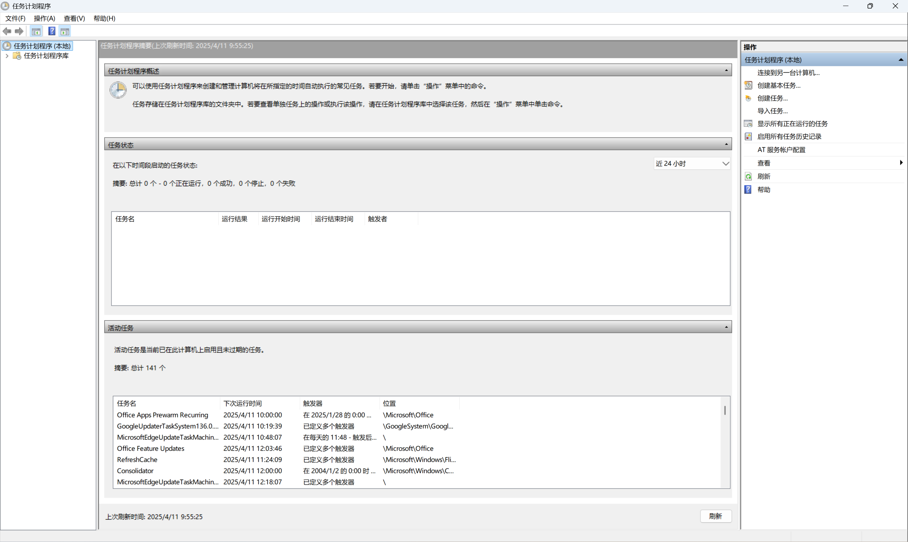
2. 创建基本任务：在任务计划程序库中，选择“创建基本任务”向导。按照向导的提示，输入任务名称和描述，选择触发器（如每天、每周、每月或在特定事件发生时），然后指定要执行的操作，如启动程序、发送电子邮件或显示消息。
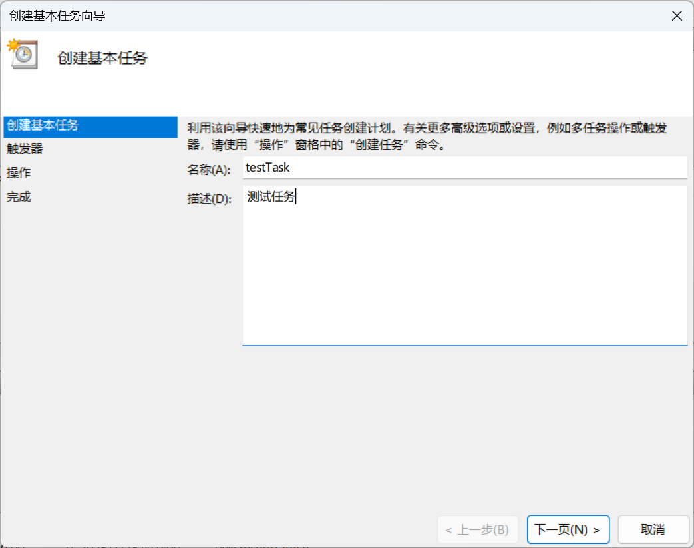
3. 创建任务：对于更复杂的任务需求，可以选择“创建任务”来手动配置任务的详细属性。在这里，可以设置任务的触发器、操作、条件和设置等更多选项。例如，可以指定任务在特定的用户登录时运行，或者在系统空闲时运行，还可以设置任务的优先级和执行限制等。

### 任务触发器

任务触发器是任务计划程序的核心部分，它决定了任务何时运行。
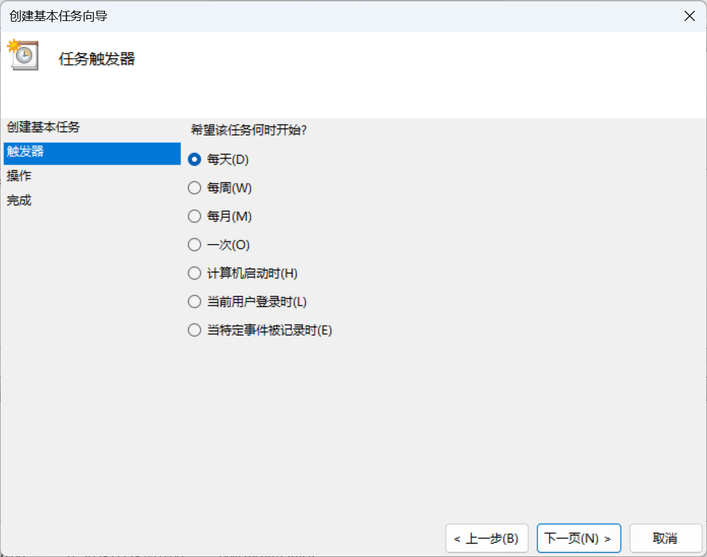
常见的触发器类型包括：
- 按时间间隔：可以设置任务在每天、每周、每月或一次性的时间点运行。
- 在特定事件发生时：例如，系统启动时、用户登录时、工作站锁定时等。
- 在系统空闲时：当系统处于空闲状态时运行任务，避免对系统性能产生影响。
- 在特定事件日志条目创建时：可以根据系统事件日志中的特定事件来触发任务，例如，当某个应用程序出现错误时自动运行修复程序。

### 任务操作

任务操作定义了任务执行的具体内容。
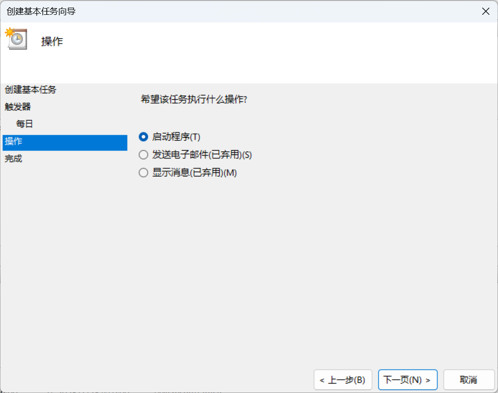
常见的操作包括：
- 启动程序：可以指定要运行的程序或脚本，例如，运行一个备份工具或执行一个清理脚本。
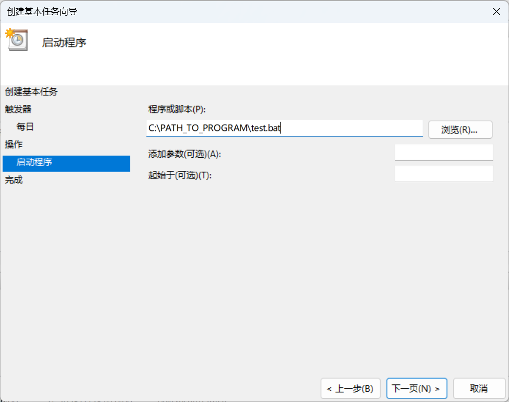
- 发送电子邮件：可以配置任务在触发时发送电子邮件通知，例如，提醒用户备份已完成或出现错误。（该项已经被弃用）
- 显示消息：在任务触发时显示一个消息框，用于提醒用户或记录事件。（该项已经被弃用）

### 任务条件和设置

任务条件和设置允许用户进一步细化任务的执行环境和行为。例如，可以设置任务仅在计算机连接到交流电源时运行，或者在任务运行时限制其对系统资源的使用。这些设置有助于优化任务的执行效率，确保任务在合适的条件下运行，同时避免对系统性能造成不必要的影响。

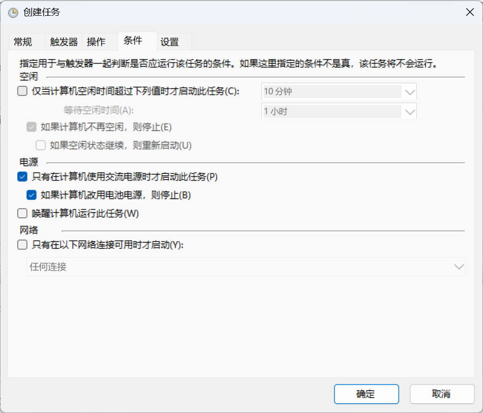
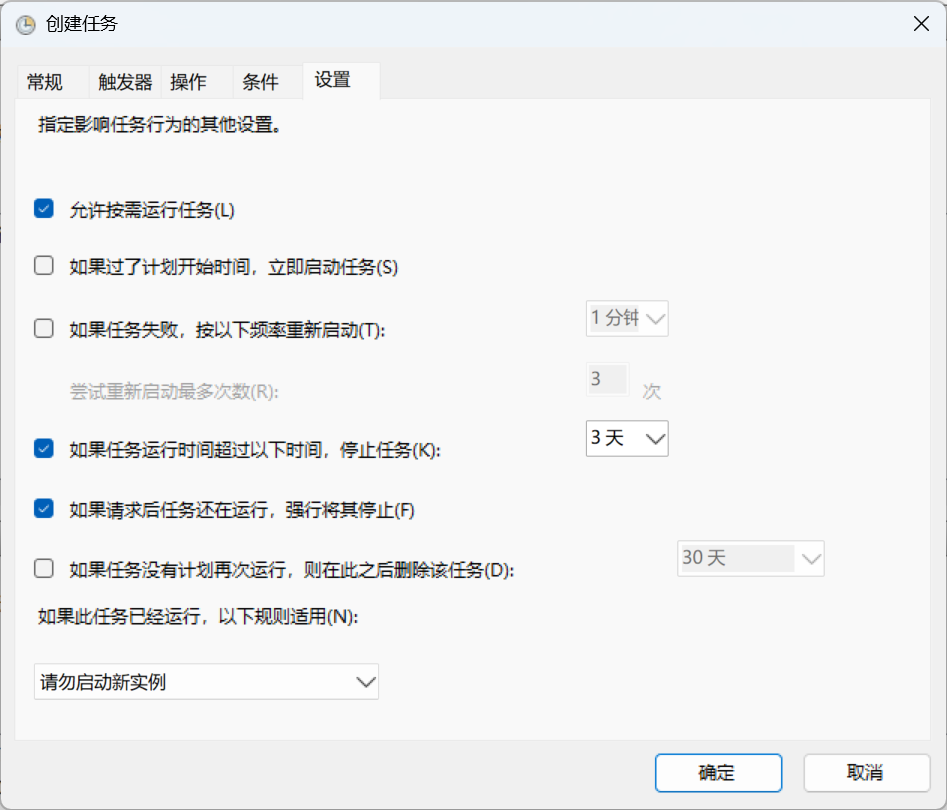

这里有几个选项应该注意：

1. 唤醒计算机运行此任务：勾选的话，即便是在睡眠状态下，该计划任务仍然会运行，可以用定时唤醒、远程桌面等场景。
2. 如果过了计划开始时间，立即启动任务：不勾选的话，意外关机或重启可能导致某次任务没有运行。

在主页，你还可以查看所有正在运行的定时任务。

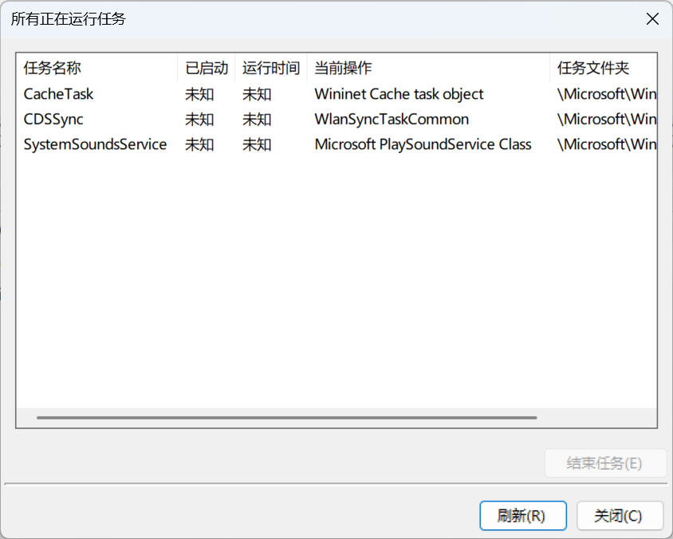

右侧的资源栏，也可以看到许多系统自带的计划任务：

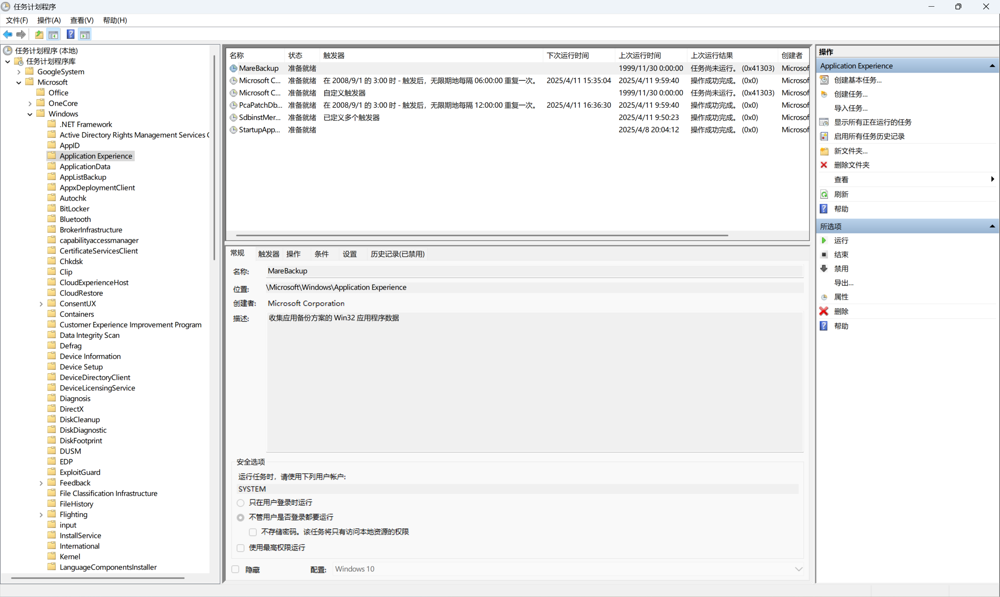

## 机器有价数据无价

数据是现代企业和个人用户的核心资产之一。无论是企业的财务报表、客户信息、研发成果，还是个人的照片、文档、视频等，这些数据都具有不可估量的价值。一旦数据丢失，可能会导致严重的后果，如业务中断、经济损失、声誉受损等。因此，保护数据安全至关重要。

### 数据丢失的风险

数据丢失的原因多种多样，常见的包括：
- 硬件故障：硬盘损坏、内存故障、主板故障等硬件问题可能导致数据无法访问或丢失。
- 软件错误：操作系统或应用程序的错误、漏洞或更新失败可能导致数据损坏或丢失。
- 人为失误：误删除文件、格式化错误、错误操作等人为因素是数据丢失的常见原因之一。
- 恶意攻击：病毒、木马、勒索软件等恶意软件的攻击可能导致数据被加密、篡改或删除。
- 自然灾害：火灾、洪水、地震等自然灾害可能导致设备损坏，进而导致数据丢失。

### 数据备份的重要性

数据备份是防止数据丢失的最有效手段之一。通过定期备份数据，我们可以确保在数据丢失或损坏时能够快速恢复数据，减少损失。备份不仅可以保护数据免受硬件故障和软件错误的影响，还可以在人为失误和恶意攻击的情况下提供恢复的可能性。此外，备份还可以帮助企业在自然灾害等不可抗力事件中快速恢复业务，减少停机时间。

### 备份策略

为了确保数据的安全和可恢复性，需要制定合理的备份策略。备份策略应根据数据的重要性和使用频率来设计，确保在数据丢失时能够快速、准确地恢复数据。

“版本”是备份中一个相当重要的概念，如果不做版本管理，那么我认为这种“备份”应该被解释为“同步”。实际上，“同步”和“备份”是两种不同的功能，不应混为一谈。

以上是 duplicati 备份软件中的备份保留策略，具有一定代表性。

1. 永久保留：不自动删除版本。
2. 删除早于条件的备份：可以指定定期删除几天前、几月前、几年前的备份。
3. 保留指定版本数：只保留 N 个版本。
4. 智能备份保留策略：随着时间，备份将被自动清理。这将保留最近 7 天中每天一份，最近 4 个星期中每星期一份，最近 12 个月中每月一份。同时，保证总是至少存在一个备份。

## RAID 与备份的区别

在讨论备份策略之前，我们先来了解一下 RAID（独立磁盘冗余阵列）与备份的区别。RAID 是一种通过将多个磁盘组合成一个逻辑单元来**提高数据存储的可靠性、性能或容量**的技术。RAID 有多种级别，每种级别都有其特定的用途和优势。

### RAID 的主要级别

- **RAID 0（条带化）**：将数据分散存储在多个磁盘上，提高读写速度，但不提供冗余，任何一个磁盘损坏都会导致数据丢失。
- **RAID 1（镜像）**：将数据同时写入两个磁盘，提供冗余，一个磁盘损坏时，另一个磁盘可以继续工作，但存储容量减半。
- **RAID 5（带奇偶校验的条带化）**：将数据和奇偶校验信息分散存储在多个磁盘上，提供冗余，允许一个磁盘损坏时恢复数据，但需要至少三个磁盘。
- **RAID 6（带双重奇偶校验的条带化）**：类似于 RAID 5，但提供双重奇偶校验，允许两个磁盘同时损坏时恢复数据，需要至少四个磁盘。

此外还存在 RAID10、SDR 等 RAID 级别，他们有着各自的用武之地。

下面详细列举了 RAID 与备份的区别：

- **RAID**：主要用于提高存储性能和可靠性，通过冗余技术防止硬件故障导致的数据丢失。只能保护硬件故障导致的数据丢失，无法保护软件错误、人为失误或恶意攻击导致的数据丢失。在硬件故障时，可以通过重建阵列恢复数据，但恢复过程可能需要时间，且在某些情况下可能会失败。
- **备份**：主要用于保护数据免受各种风险（包括硬件故障、软件错误、人为失误、恶意攻击等）的影响，提供数据的副本以便在数据丢失时恢复。可以保护数据免受各种风险的影响，包括硬件故障、软件错误、人为失误、恶意攻击等。通过备份副本可以快速恢复数据，恢复过程相对简单，且备份副本可以存储在不同的位置，提供更高的数据安全性。

有人说，RAID 就等于数据备份，但实际上 RAID 对于空间的利用率低，对钱包和盘位不太友好。并且 RAID 的实际作用是保证在**某块硬盘坏掉的情况下，服务仍然可用**，也就是说 RAID 是为保障服务的不间断性而存在的，绝不等同于备份，其次，RAID 的重建不一定能成功，如果失败，还是要靠真正意义上的“备份”来还原数据。

## 如何正确备份？

为了确保数据的安全和可恢复性，我们需要制定合理的备份策略。备份策略应根据数据的重要性和使用频率来设计，确保在数据丢失时能够快速、准确地恢复数据。以下是一些常见的备份策略：

### （一）普通数据：异盘双备份

对于普通数据，建议采用异盘双备份策略。这种策略的基本思想是将数据备份到两个不同的存储设备上，这两个设备可以是本地的硬盘、外部硬盘、网络附加存储（NAS）或云存储。

### （二）重要数据：异地三备份

对于重要数据，建议采用异地三备份策略。这种策略的基本思想是将数据备份到三个不同的存储设备上，且至少有一个备份存储在异地。这样可以确保在本地发生灾难性事件（如火灾、洪水等）时，数据仍然可以安全恢复。
### Windows 备份

在 Windows11 上，备份应用无法在大陆地区使用。

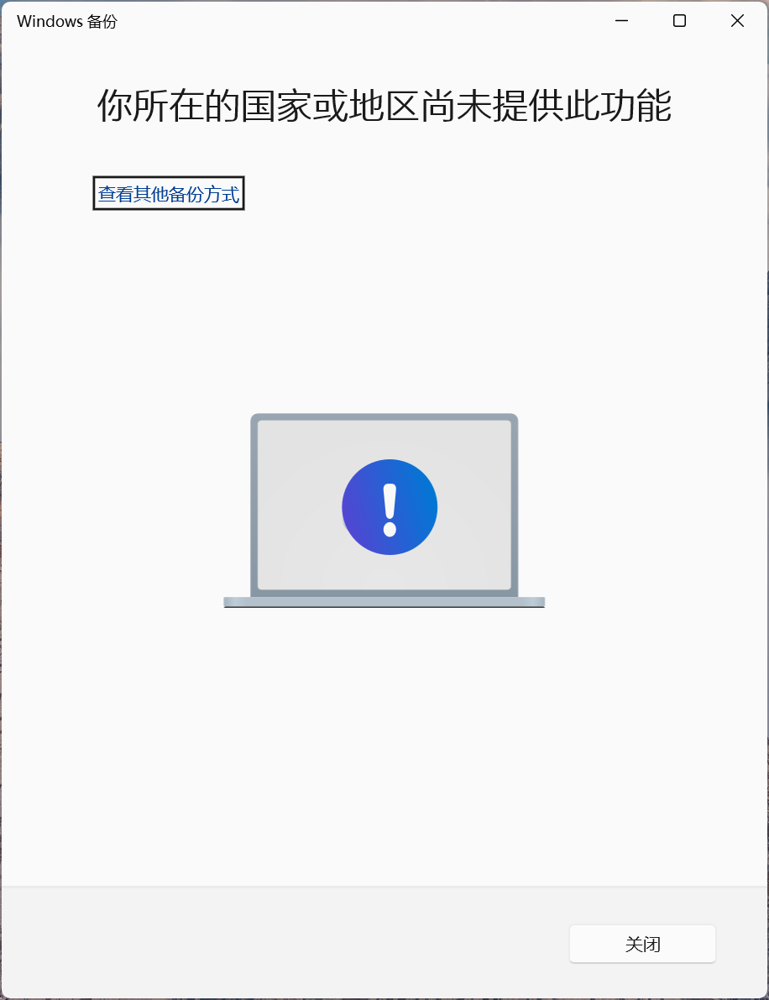

但是 Server 版本的系统提供了完整的备份服务（虽然并不好用）。

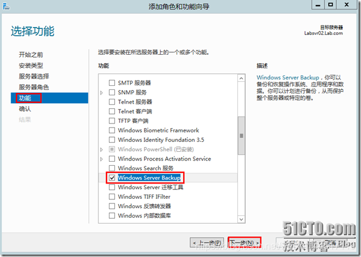

这个备份软件比较简单易用，这里提供一个链接供学习  [Windws Server 2012 Server Backup](https://blog.csdn.net/weixin_44517119/article/details/87161072)

Windows Server 备份实际上是增加了一个用于备份的任务计划程序，在之前提到的任务计划程序中，可以更加细粒度地条件备份细节，例如运行频率等。